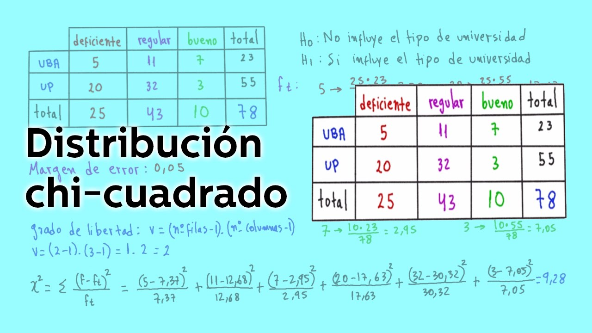

```{r setup, include=FALSE}
library(plot3D)
library(chron)
library(psych)
library(nortest)
library(ggplot2)
library(ggmap)
library(NADA)
library(MASS)
library(readxl)
library(plotly)
library(tibble)
library(ggridges)
library(dplyr)
library(ggrepel)
library(gridExtra)
library(ggpubr)
library(car)
library(plyr)
library(ggpmisc)

library(caret)
library(mlbench)
library(AppliedPredictiveModeling)
library(e1071)
library(lattice)
library(Rcpp)
library(corrplot)
library(Amelia)
library(RCurl)
library(tidyverse)
library(klaR)
library(rpart)
library(randomForest)
library(glmnet)
library(kernlab)
library(C50)
library(caretEnsemble)
library(profvis)
library(Cubist)


library(knitr)
library(knitLatex)
library(tinytex)
library(rmarkdown)
```

# Chi Cuadrado Iguales Proporciones

Es un test para poder determinar si **las proporciones poblacionales** son iguales.

Debemos tener en cuenta la funcion `chisq.test()` para evaluar. Ver formula en la web de **Williams**^[https://sites.williams.edu/bklingen/files/2012/02/R-code-for-inference-about-several-proportions.pdf].

_Ejemplo7_:

```{r}
table = matrix(c(115,53,40,98,35,22,35,40,8,5,4,5),ncol=4,byrow=TRUE)
table
```

\newpage

```{r}
colnames(table)=c("AAHH1","AAHH2","AAHH3","AAHH4")
rownames(table)=c("De acuerdo","En desacuerdo","No opina")
table
chisq.test(table)
chisq.test(table)$expected
```

Esta advertencia se produce porque muchos o algunos de los valores esperados son
muy pequeños y las aproximaciones del **p-valor** pueden no ser _correctas_,para
limpiar esto debemos usar el argumento de la funcion **chisq.test()** el cual es `simulate.p.value = TRUE`.

```{r}
chisq.test(table,simulate.p.value=TRUE, B=3000)
```

Otro connatacion que existe es que se asume que la data es normalmente distribuida,
si es pequeña la aproximación esto puede ser pobre.

**Nota**:

  *El valor de estadístico de prueba se aproxima a una distribución χ2c, si n≥30 y todas frecuencias esperadas Ei son mayores que 5 (en ocasiones deberemos agrupar varias categorías a fin de que se cumpla este requisito).
  
    *Tener en cuenta que se puede realizar el test de Fisher.

Pero para la solucion nuestra juntaremos dos filas:

```{r}
table2 =matrix(c(115,50,40,98,43,27,39,45),ncol=4,byrow=TRUE)
table2
colnames(table2)=c("AAHH1","AAHH2","AAHH3","AAHH4")
rownames(table2)=c("De acuerdo","En desacuerdo/No opina")
table2
chisq.test(table2)
```


Final de la clase:




