background-image: url(https://upload.wikimedia.org/wikipedia/commons/b/be/Sharingan_triple.svg)

```{r setup, include=FALSE}
options(htmltools.dir.version = FALSE)
```

```{r xaringan-themer, include=FALSE, warning=FALSE}
library(xaringanthemer)
style_duo_accent_inverse(primary_color = "#035AA6", secondary_color = "#03A696")
```

Image credit: [Wikimedia Commons](https://commons.wikimedia.org/wiki/File:Sharingan_triple.svg)

---
class: center, middle

# Data Science in Geology and Machine Learning

### /ʃaː.'riŋ.ɡan/

---
class: inverse, center, middle

# Empecemos!!

---
background-image: url("fotos/Alo_Joseps.jpg")
background-position: center
background-size: cover
class: left, top, inverse

# Al infinito y más allá!

---
class: inverse, middle, center

# R

---
class: center

# R

Es un **potente lenguaje orientado a objetos y destinado al análisis estadístico y la representación de datos desarrollado** por Ross Ihaka y Robert Gentleman en 1993. Es además un software libre. En la cual ingenieros, científicos, economistas entre otras ramas trabaja en el análisis de datos. Se puede considerar a R como un software estadístico del 2021 y a su vez un lenguaje de programación.

--

# ¿Porqué usar R?

Es libre - multiplataforma - Analiza cualquier tipo de objeto.

Es potente, **sumamente potente**. Es ampliable.

Su capacidad gráfica es difícilmente superada por algún paquete estadístico.

Es compatible con casi todos los formatos de datos (.csv, .xls, .xlsx, .sav, .sas, .shp, .Geotiff, .xml, .dat, .sql, .py, entre otros).

Hay miles de técnicas estadísticas implementadas, y cada día más.

---
class: inverse, middle, center

# Rstudio

---

# Rstudio

Es una herramienta **IDE (Integrated Development Enviroment)** fundada por J.J Allaire, es libre y gratuita con los siguientes beneficios:

--

* Trabaja con R de forma interactiva.
* Organiza el código y mantiene en múltiples proyectos.
* Actualizaciones y mantenimiento de paquetes.
* Crear y compartir informes de forma sencilla.
* Compartir código y colaborar con otros usarios (*implementar técnicas*).
* Permite *automatizar procesos* crear **Dashboards, documentos interactivos (html - web based), aplicaciones interactivas, programas, paquetes, APIs, Modelos, entre muchos otros**.

--

Rstudio `no realiza operaciones estádisticas solo facilita realizarlas`. Instalar **Rstudio** IDE desde [Rstudio IDE](https://www.rstudio.com/products/rstudio/download/#download)

--

- Crear un nuevo documento Rmarkdown desde el menú `File -> New File -> R Markdown -> OK`;<sup>1</sup>

- Click en el botón `Knit` para compilar;

--

.footnote[
[1] Mirar [#1](https://github.com/yihui/xaringan/issues/2) si existen problemas para descargar Rstudio.
]

---

# Características de Rstudio

- Integración – Ejecución - Resaltado.
- Ayuda - Autocompletado.
- Teclas de atajo.
- Navegadores de Objetos.
- Gestión del historial de comandos.
- Navegación del Código.
- Importación y visualización de datos.
- Integración de gráficos.
- Gestión de proyectos.
- Control de versiones.
- Generación de documentos.

---

# Rstudio y herramientas IA

.pull-left[
```{r out.width = '60%',echo=FALSE, fig.cap="ChatGpt & Rstudio"}
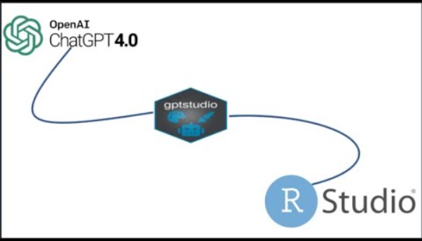 
```
]

.pull-right[
```{r out.width = '60%',echo=FALSE, fig.cap="AI Tools"}
 
```
]

---

# Ser un desarrollador y conocer todo??

.pull-left[
```{r out.width = '60%',echo=FALSE, fig.cap="Algunos software comerciales"}
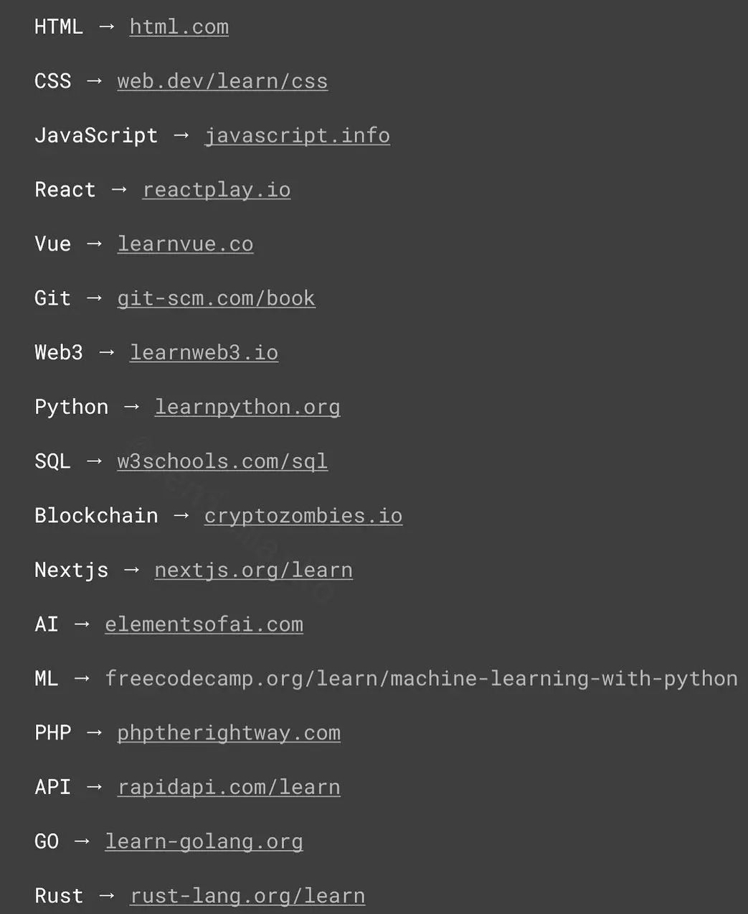 
```
]

.pull-right[
```{r out.width = '60%',echo=FALSE, fig.cap="Camino para desarrollar"}
 
```
]

---

# R Y RSTUDIO - TRANSFORMACIÒN DIGITAL

```{r out.width = '80%',echo=FALSE, fig.cap="R Transformacion Digital Geocientífica", fig.align='center'}
 
```

---

# R Y RSTUDIO BIG DATA Y MACHINE LEARNING

```{r , out.width = '90%',echo=FALSE, fig.cap="Big Data y Machine Learning Geocientítico", fig.align='center'}
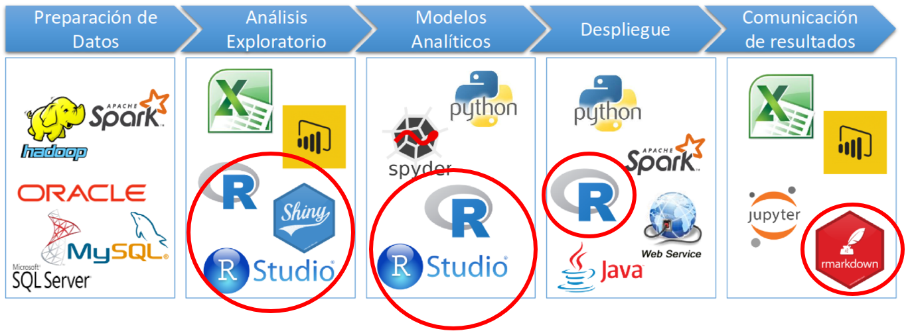 
```
---

# Entorno de Rstudio

.pull-left[
- Abrir el IDE Rstudio `File -> New File -> R Script -> Click`;<sup>0</sup>

- Escribir `summary(cars)`;<sup>1</sup>

- Click en `Run`;<sup>2</sup>

- Mirar la Salida;<sup>3</sup>
]

.pull-right[
```{r out.width = '60%',echo=FALSE, fig.cap="Entorno Rstudio"}
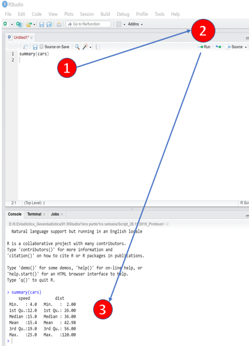 
```
]

---

# Entorno de Rstudio Paneles

```{r ,echo=FALSE, fig.cap="Entorno Rstudio Paneles", out.width='80%', out.height='60%',fig.align='center'}
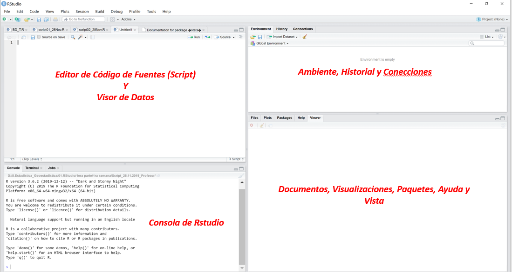 
```


---

# Curva de Aprendijaze

```{r, out.width = '65%',echo=FALSE, fig.cap='Capacidad Vs. Curva de Aprendijaze.', fig.align='center'}
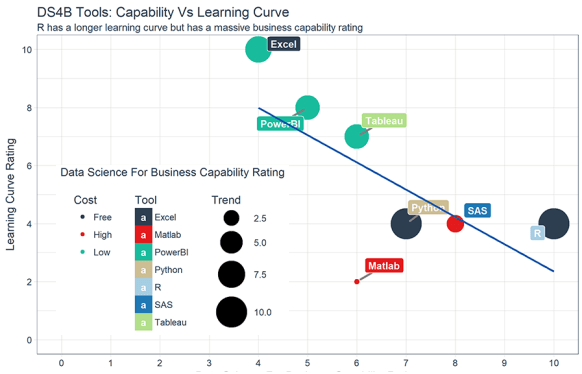 
```

---
class: inverse, middle, center

# Paquetes y Librerias

---

# Paquetes y Librerias por Defecto


.pull-left[
Paquetes desde 1997 hasta el 2019
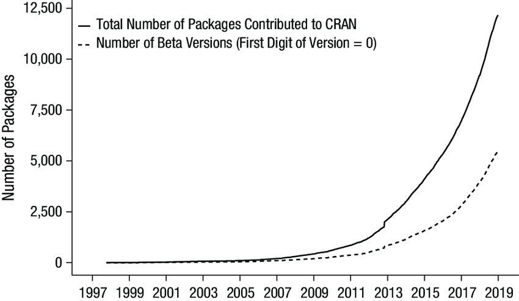
]

.pull-right[
Red Neuronal de Paquetes
```{r out.width = '80%',echo=FALSE}
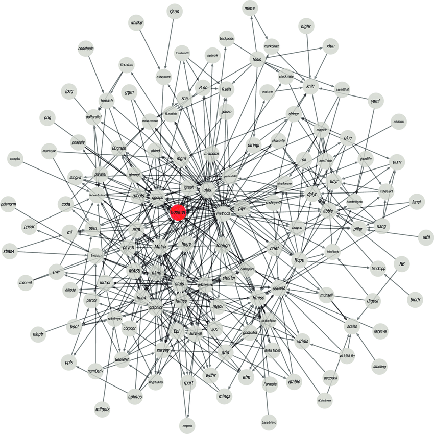 
```
]

---

.pull-left[
Paquetes de Rstudio
```{r out.width = '80%',echo=FALSE}
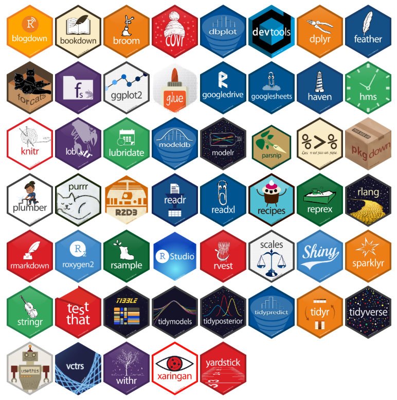 
```
]

.pull-right[
Instalar un paquete y llamar un paquete
```{r out.width = '80%',echo=FALSE}
knitr::include_graphics("figuras/install_vs_library.jpeg") 
```
]

---

# Creando un Proyecto para Trabajar:

Para crear un **proyecto** para trabajar necesitamos realizar los siguientes pasos:

.pull-left[
- Abrir Rstudio `File -> New Project -> New Directory -> New Project`;<sup>1</sup>

- En el directorio `Directory name -> Browse (Ubicar) -> Create Project (Click)`;<sup>2</sup>
]

.pull-right[
```{r, eval=FALSE, warning=FALSE, message=FALSE}
#Directorio y Archivos Contenidos
dir()
#Funciones de Ayuda de Funciones:
help.start()
help(sum)
?sum
help.search("sum")
```
]

.footnote[[*] Es importante tener como fuentes de ayuda [Stackoverflow](https://stackoverflow.com/), [R help](https://www.r-project.org/help.html), además del buscador de google como básicos, más adelante se buscarán soluciones a preguntas más complejas.
]

---
background-image: url("fotos/Joseps.jpg")
background-size: cover
class: right, top, inverse

# Un momento voy a tomar mi muestra de agua!

---
class: inverse, middle, center

# Mi primer Script

---

# R como calculadora científica

R como calculadora científica es muy útil en la realización de cálculos matemáticos desde los *simples* hasta los **complejos**.

Para ejecutar ubicarnos al inicio de la lína y **Ctrl + Enter**.

```{r, eval=TRUE, warning=FALSE, message=FALSE}
2+2
sin(log(1+sin(pi/4)))
rnorm(10, mean=3, sd=2.4)
```

* Las áreas de interés de usuarios R, ver [Cran Task View](https://cran.r-project.org/web/views/) o también en [CRAN ORG](https://cran.r-project.org/web/views/)

---

# Tipos de Variable y Operadores en R

Existe una secuencia en las características de los objetos en R: modos y atributos. 
En la cual **objetos -> compuesto de elementos -> tipo de elementos más simples: variables**

--
.pull-left[

* Tipos de Data en R:

1. *Escalares*

1. *Vectores* (numeric, character, logical).

1. *Matrices*.

1. *Dataframe*.

1. *Listas*.

]

--
.pull-right[

* Básicos:<sup>*<sup>

1. `Numeric`: Número real tales como 4.5, 9, -2, notación científica 3.12e-47.

1. `Logical`: **TRUE - FALSE** que es un *booleano*.

1. `Character`: Valor dentro de "" o `` son textos (*string*).

1. `Complejos`: Números de la forma $a+bi$.

]

--

.footnote[[*] Existen otras clasificaciones.]

---

# Ejemplos de Tipo de Variables

```{r}
x <- 28
class(x)
y <- "R es fantastico"
class(y)
z <- TRUE
class(z)

#Guardar variables creadas:
#<< save.image("mydata.RData") # Guarda variables del enviromment.
#<< load("mydata.RData") #Carga las variables guardadas.
```

---

# Operadores Básicos en Rstudio:

```{r ,out.width = '90%',echo=FALSE, fig.cap="Operadores Aritméticos y Lógicos", fig.align='center'}
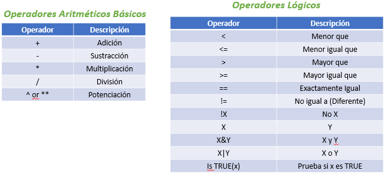 
```

---
class: inverse, middle, center

# Definición de Vectores en R

---

# Vectores en Rstudio

Los vectores son un **arreglo unidimensional** el cual es un objeto en R, los números son interpretados como vectores de una componente. La forma de crear un vector es con la función `c()`.

.pull-left[
```{r}
#Generando variable
vec_num <- c(1, 10, 49) #<< 
vec_num
vec_chr <- c("a","b","c") #<< 
vec_chr
vec_bool <- c(TRUE, FALSE, TRUE) #<< 
vec_bool
```
]

.pull-right[
```{r}
vector_01 <- rnorm(12, mean=4, sd=2)
random_01 <- c(rnorm(5,10,5),runif(15,14,20)) 
range(random_01)
range(random_01)[1]
range(random_01) == range(random_01)[1]
random_02 <- rexp(10,0.5) #rexp(n,rate) genera números aleatorios 
#de la función exponencial.
```
]
---
# Jugando con Vectores I

.pull-left[
```{r, fig.align='center'}
y <- 42
Espero_sea_buena_la_clase <- c(20,20)
espero_sea_buena_la_clase <- c(20,20)
Variable.1 <- c(1,2,3,4,5)
variable.1 <- c(1,2,3,4,5)
dist.normal.random <- rnorm(n = 45, #<<
                            mean = 12, #<<
                            sd = 5) #<<
dist.normal.standarize <- rnorm(n = 45, 
                                mean = 0, 
                                sd = 1) 
```
La diferencia entre las líneas está basado en diferencias entre *mayúsculas y minúsculas* lo cual diferencia la creación de las variables. 
Las funciones generadas con `rnorm()` son distribuciones **r**(random) y **norm**(normal) la primera es normal no estandar y la segunda normal estandar.
]

.pull-right[
```{r, out.width = '40%'}
hist(dist.normal.random); plot(dist.normal.random); boxplot(dist.normal.random);qqplot(x = dist.normal.random, y = dist.normal.standarize)
```
]

---
# Jugando con Vectores II

Para acceder a un elemento del vector usamos `[]`.

.pull-left[
```{r}
weight <- c(33,45,78,77,45,89,48,75)
length(weight) # Dimensión del vector
weight[4] #Ingresar al elemento 4.
vector <- 1:20 #Creando sin función c()
altura <- c(1.70, 1.45, 1.54, 1.72, 1.85 ,1.45, 1.79, 1.80)
IMC <- round(weight/(altura^2),1)
IMC
```
]

.pull-right[
Para hacer una formulación lógica debemos considerar la siguiente estructura: **variable_estudio**[`(sentencia_logica)`]
```{r}
vector <- c(1,5,2,6,4,5,74)
vector > 5
vector[(vector > 5)]
vector[(vector > 1)&(vector < 7)]
```
]

---
# Consideraciones del entorno R en el Script

```{r ,out.width = '80%',echo=FALSE, fig.cap="Entorno al Crear Objetos", fig.align='center'}
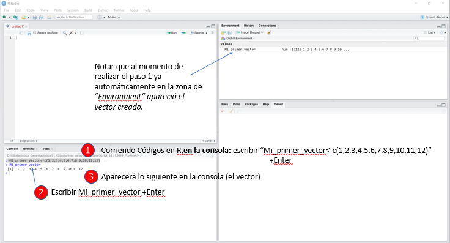 
```
---
class: center

# Consideraciones del entorno R en el Script

Tratar de no usar tíldes, ni la ñ, entre dos palabras o más no dejar el espacio libre, ejemplo *“Mi priñer vector”* en cambio usar *“Mi_priner_vector”* debido a que se puede trabajar mejor en el software, además cabe mencionar que debemos **ser lo más simple al momento de realizar los códigos**, es decir no usar nombres extensos sino representativos, por ejemplo *Resultados Económicos del año 2018*, en cambio usar *RE_2018*.

Tener en claro que el paso más importante es la codificación completa del proyecto que vamos a trabajar para no tener problemas al momento de crear variables y relacionarlas. Además de las *esctructuras de las carpetas*.

Siendo un entorno dinámico tiene un enfoque mientras menos mejor, esto está en función de reducir largos procesos de códigos un simple ejemplo es escribir *vector <- c(1,2,3,4,5,6,7,8,9,10,11,12,13,14,15)* en cambio se puede usar **vector<-c(1:15)** buscando siempre la manera más simple del código, tener en cuenta que siempre se puede sino se crea.

---

# Funciones Básicas

Las funciones básicas son :

.pull-left[
```{r, eval=FALSE}
#Sesion
dir() #<<
sessionInfo()
date()
Sys.time()
help()
?
#Objetos:
str() #<<
colnames()
rownames()
dim() #or length()
View()
```
]

.pull-right[
```{r, eval=FALSE}
# Estadisticas
range()
summary() #<<
sum()
min()
max()
mean()
meadian()
sd()
scale()
quantile()
var()
cov()
cor()
```
]

---

# Datos Especiales

* NA (NOT AVAILABLE).

Generalmente nuestra base de datos posee siempre datos que **no son completamente conocidos o son vacíos** por ejemplo: en Excel una celda vacía la cual se reconocerá como un *dato no existente*, posiblemente se pueda usar una función para omitir estos datos o `tratar esos datos faltantes de forma especial` (por ejemplo: reemplazarlo por la media aritmética, la mediana, medias cortadas, método ROS, entre otros siempre y cuando sea la variable faltante numérica), al aplicar cualquier función de las básicas enseñadas el código corre según:

`na.rm = FALSE` (que indica que no se eliminan los NA) que se usa cuando existe al menos un dato faltante, si nosotros cambiamos la opción por default de la función y aplicamos `na.rm =TRUE` (indicamos que sólo trabaje con datos válidos).

```{r}
weight<-c(33,45,78,77,45,89,48,75,NA)   #Para ejecutar aplicamos (Ctrl+Enter)
mean(weight)			       #Calculamos la media
mean(weight , na.rm =TRUE) 	       #Media sin considerar not avalaible (NA)
```

---

```{r}
x <- NA				       #para ejecutar aplicamos (Ctrl+Enter)
x+1			             #calculamos lo pedido (¿Qué pasó?)
y <- c(x,3,5,x)	      
mean(y)			       #calculamos media aritmética de y.
```

---

* Inf (Infinito) y NaN (Not a number)

Al realizar cálculos en Rstudio en determinadas ocasiones puede resultar un valor *infinito positivo (+Inf) o infinito negativo (-Inf)* adicionalmente R permite hacer cálculos aproximados con este número, aunque existen condiciones en las cuales las expresiones son expresadas como *NaN´s (not a number)*.

Se debe tener en cuenta que los números complejos el R los trabaja con normalidad, sin embargo se debe citar estos números, por ejemplo: $22+3i, i+45, i^233+154 o 0+2i$.

```{r, eval=FALSE}
#Ejecutemos los siguientes códigos en R:
log(10/0)+log(0/10)			
sqrt(-24)			
sqrt(-24+2i)	                                                           
y<-23/0					       
exp(-y)
exp(y)-exp(y)	
```

--

!R STUDIO O R REALIZA APROXIMACIONES DE LOS VALORES CON TENDENCIA DE LÍMITES. VARIANZA(NO!) CuasiVarianza(SI!!).

---
background-image: url("fotos/Alonso.jpg")
background-size: cover
class: right, top, inverse

# Ya caminamos mucho a Descansar!

---

class: inverse, middle, center

# MATRICES

---

#Concepto de Matrices

Las matrices son un *arreglo bidimensional* el cual es un objeto en R, los números son interpretados como vectores de dos componenetes (un vector define el número de columnas y el otro el número de filas) los elementos deben ser del *mismo tipo*. La forma de operar es con la función `matrix(data, nrow, ncol, byrow =FALSE)`.

--

Argumentos Básicos:

data: Colección de elementos que R arreglará.
nrow: Número de filas
ncol: Número de columnas
byrow: Las filas son llenadas de izquierda a derecha con el default.

--

* Debemos considerar las funciones `is.matrix()` y `as.matrix()` que comprueban o fuerzan el carácter de mariz de un objeto respectivamente. Generalmente con el atributo `dimnames()` damos nombre a las filas y coumnas de una matriz.

--

* Además R tiende a realizar todo sencillo, es decir seleccionar una columna, el objeto resultante es un vector y no una matriz, en el caso se desee mantenera las dimensiones añadir `drop = F`.

--

* Tenemos que considerar el reciclado que sucede al momento de añadir el vector a una matriz, este vector se extiende repitindo sus elementos hasta alcanzar el tamaño de la matriz.

---

# Ejemplo de Matrices

Crearemos una matriz y analizaremos

--

```{r}
matrix_01 <- matrix(1:12, byrow= TRUE, nrow=6)	 #Para ejecutar aplicamos (Ctrl+Enter)
matrix_01			                                   #Visualizar la matriz (¿Qué vemos?)
dim(matrix)	                                   #Ver la dimensión de la matriz
```

---

Crear una matriz con cinco filas que contienen los números del 1 al 10 y sea por columnas. Ver matriz y calcular la dimensión. Buscar otra forma de hacerlo diferente a la primera. Discutir.

```{r}
y <- c(1:8) 	       			                      #Para ejecutar aplicamos (Ctrl+Enter)
dim(y) <- c(2,4)			                         #Asignamos la dimensión de la matriz
dimnames(y) <- list(c("F1","F2"), c("C1","C2","C3","C4"))  #Colocamos nombres a la matriz
covid_19 <- matrix(1:12, ncol=3,dimnames =list( c("Desobedece mucho",
                                                  "Desobedece", "Obedece",
                                                  "Es fiel"), letters[1:3]))
covid_19
#Creamos la matriz con filas de comportamiento
```

---

Tenemos opciones de entrar a los elementos o grupos de elementos de la matriz (también se puede hacer con el vector)  usando `[]` (corchetes). 

Por ejemplo: 

* matrix[n,m] selecciona los elementos de la fila n y la columna m.
* matrix[ ,m] selecciona todos los elementos de la columna m.
* matrix[n, ] selecciona todos los elementos de la fila n.

Además si realizamos lo siguiente: *matrix[1:3,2:3]* accedemos a la data  de las *filas 1,2,3 y de las columnas 2 y 3*. También se pueden elegir los nombres como un vector.

--
.pull-left[
```{r}
covid_19 [1,1]
covid_19 [ , c(2,3)]
```
]

.pull-right[
```{r}
covid_19 [ , c(-1,-3), drop=F]
covid_20 <- matrix(rep(c(T,F),6),4,3)
covid_19[covid_20]
```
]

---

.pull-left[
```{r}
m <- matrix(1:8, 2, 4)
diag(m)  # diag(m) extrae la diagonal de la matriz creada
m[ ,3]
m[ ,3, drop=FALSE]
m[1, 1:2]
w <- matrix(1:8, 4, 2)
w[3, ]
```
]

.pull-right[
```{r}
ncol(m);ncol(w);nrow(m);nrow(w) # ncol(m) número de columnas de m.
m
t(m)
```
]

---

.pull-left[
```{r}
#Creamos la matriz Economia
Economia<-matrix(1:10, byrow=TRUE,nrow=5)
View(Economia)
# cbind() y rbind(): La función cbind() concatena columnas y la función rbind() concatena filas.
# A la matriz Economia concatenaremos con el vector Geologia<-c(1:5)
Geologia<-c(1:5)
Mina <- cbind(Economia,Geologia)
dim(Mina)
#Creamos la matriz denominada mama
mama <- matrix(13:24, byrow=FALSE, ncol=3)
#Creamos la matriz ama
ama <- matrix(1:12,byrow=FALSE,ncol=3)
#Unimos las matrices mama y ama:
mama_ama <- cbind(mama,ama)
#Probar Mina y mama, ¿cómo se haría?
Mina_mama <- rbind(Mina,mama)
```
]

.pull-right[
```{r}
#Continuando con la matriz m.
cbind(1,m) ; cbind(m,1) ; rbind(1,m); rbind(m,1)
#Háganlo ustedes con w.
# cbind(1:3,1:6)  #Probemos con esto.
# apply(w,1,sum) #¿Que será?
```
]

---

class: inverse, middle, center

# Otras Funciones Basicas

sort() - seq() - rep()

---

# Secuencia : seq()

Función seq(from=1, to=1, by=((to-from)/(length.out-1)), lengout.out=NULL, along.with=NULL, ...)

Genera secuencias regulares en los cuales los argumentos son:

`From, to`: el comienzo y el final (máximo) valores de la secuencia. De *length* 1 a menos solo *from* suministra como un no nombrado argumento.

`by`: número incremento de la secuencia.

`length-out`: deseada longitud de la secuencia. Un número nonegativo, el cual para *seq* y *seq.int* será redondeado a un fraccional.

`along.with`: tomar la longitud desde la longitud de este argumento.

---

.pull-left[
```{r}
seq(0, 1, length.out = 11)
seq(stats::rnorm(20)) # effectively 'along’
seq(1, 9, by = 2)     # matches 'end’
seq(1, 9, by = pi)    # stays below 'end'
seq(1, 6, by = 3)
```
]

.pull-right[
```{r}
seq(1.575, 5.125, by = 0.05)
seq(17) # same as 1:17, or even better seq_len(17)
seq(2, 4, by = 0.02)
seq(7, 14, length.out = 15)
c(seq(1, 6, by = 3), seq(2, 8, by = 2))	
```
]

---
# Repetición: rep()

Función rep(x, ...). Replica los valores en x, los argumentos son:

`x` = un vector(de cualquier modo incluyendo en una lista) o un factor or (para *rep* solo).
`...` = otros argumentos para ser pasados para o desde otros métodos, por ejemplo:

````r
times = un vector de valor entero dado el número de veces para repetir cada elemento o repetir el vector enterto de la longitud dada.

length.out = Entero no negativo. El deseado de la longitud de la salida del vector. Otros *inputs* deberán ser forzados como un vector doble y el primer elemento tomado.

each = Entero no negativo. Cada elemento de x es repetido cada vez.. Otros *Inputs* deberán ser forzados como un entero o vector doble y el primer elemento a ser tomado. Tratado como 1 si NA o invalido.
````

```{r}
rep(1:4, 2) ; rep(1:4, each = 2) ; rep(1:4, c(2,2,2,2))
```

---

.pull-left[
```{r}
rep(1:4, c(2,1,2,1))
rep(1:4, each = 2, len = 4) 
rep(1:4, each = 2, len = 10) 
rep(1:4, each = 2, times = 3)
rep(1, 40*(1-.8))
rep(1, 40*(1-.8)+1e-7) 
```
]

.pull-right[
```{r}
fred <- list(happy = 1:10, name = "squash")   #Replicar una lista
rep(fred, 2)
x <- .leap.seconds[1:3]                        #date-time objects
rep(x, 2)
rep(as.POSIXlt(x), rep(2, 3))
```
]

---

```{r}
x <- factor(LETTERS[1:4]); names(x) <- letters[1:4]   ## factor nombrado
rep(x, 2)
rep(x, each = 2)
rep.int(x, 2)  # no names
rep_len(x, 10)
```

---
# Ordenar: sort()

Función sort(x, decreasing=FALSE, ...). Replica los valores en x, en los cuales los argumentos son:

`x`: para *sort* un objeto de R (vector) con una clase o un número, complejo, carácter o lógico, o un factor.

`decreasing`: lógico. Deberá el *sort* incrementarse o disminuir? Para el método **radix**, esto puede ser un vector de igual para el número de argumentos dentro.. para otros métodos debe ser *length* uno.

`...`: Argumentos para pasara o desde métodos o (or defecto métodos u objetos sin ninguna clase) para *sort.int*.

```{r}
sort(c(1,2,4,5,7,45,78,7,8,4,7,5,4,7,4,4,44))
sort(rev(c(1,4,7,8,5,2,3,6,9)))
rep(c(sort(c(1,2,3)), 2))
```

---

## Sort y Rep:

```{r}
sort(rep(1,4,by=0.5))
sort(rep(seq(1,25,by=3),3)) #<<
rep(c(2,3,5), each=5)
```

---

# PRACTICAR!

Revisar dentro de :

```r
4.MaterialExtra/ejerciciosauxiliares/00Simple_Plot.R

&

4.MaterialExtra/ejerciciosauxiliares/01Vectores_Matrices.R

```


---
class: inverse, middle, center

# Dataframe
---

# Dataframe

Un dataframe (objeto) es una lista de vectores los cuales tienen igual longitud. Una matriz a diferencia de los dataframe contiene solo un tipo de data, mientras que los dataframe aceptan todo tio de data (*numerica, factor, caracter, etc.*)

**Creando un Dataframe**: Podemos crear un dataframe convirtiendo las variables a,b,c,d,e,... con la función `data.frame()`. Podemos cambiar el nombre de las columnas con *name()* y especificar de manera simple el nombre de las variables.


$$data.frame (df, stringAsFactors=TRUE)$$

`df`: Puede ser una matriz convertidad como un dataframe o una colección de variables a unir.
`stringAsFactors`: Convertir un *string* a *factor* por defecto.

.footnote[Consultar funciones en help->as.data.frame, is.data.frame, data.frame y similares.]

---

```{r}
a <- c(10,20,30,40)					       #Creamos una variable a
b <- c("libro","lapicero","notas","portapincel")  #Creamos una variable b
c <- c(TRUE,FALSE,TRUE,FALSE)           #Creamos una variable c
d <- c(7.4,4.5,8,22)					      #Creamos una variable d
#Uniremos todas las variables para crear el dataframe     
df <- data.frame(a,b,c,d)       	#Creando el dataframe
#Como nos damos cuenta el dataframe no tiene nombres, crearemos estos:
names(df) <- c("ID","Items","Stock","Precio")   #Asignamos los nombres del dataframe.
str(df)					                       #Verificamos la estructura del dataframe
#edit(data.frame(df)) #Editar online
#Trabajen en el siguiente ejemplo:
x <- c(2,7,8,9,2,4)
y <- matrix(x, ncol=3)                   		
colnames(y) <- c("Y1","Y2","Y3") ; rownames(y) <- c("CasoA","CasoB")		
w <- as.data.frame(y)
```

---

```{r}
#Comparemos lo siguiente (¿Cuál es la diferencia?)
str(y)
str(w)
```

`Moverse en el dataframe`: Es posible moverse dentro de los valores del *dataframe* o en los rangos que se desea, similar a la matriz. Debemos seleccionar las filas y columnas y retornar estos valores dentro de corchetes por el nombre $dataframe$, es decir **df[A,B]** donde A representa las filas y B las columnas.

```{r}
#Probemos con lo siguiente
df[1,2]							#Analicemos que está pasando!!
```

---
```{r}
#Hagamos lo siguiente
df[1:2, ]							#Analizar
df [ , 1]	            #Analizar
df[1:3,3:4]						#Analizar
#Ahora esta forma
df[ , c("ID","Items")]
```

---

.pull-left[
`Agregar Columnas al Dataframe`: Podemos agregar columnas solo necesitamos adicionar el simbol dolar.

```{r}
#Creamos un nuevo vector
w$Y4<-c("si","no")
w
cantidad <- c(10,35,40,45)
# A gregamos cantidad al df dataframe
df$cantidad <- cantidad #¿Qué pasa?
df
```
]

.pull-right[
`Seleccionar una columa del Dataframe`: Algunas veces necesitamos alamacenar una columna de un dataframe para usarla en el futuro o mejorar operaciones en la columna. Podemos usar el símbolo `$` para seleccionar una columna del dataframe.
```{r}
df$ID
df$Y1
```
]

---
# Subset de Data

A veces necesitamos trabajar con ciertos datos de nuestro *dataframe* no con todo, por eso es útil realizar un **subset** de nuestra data para filtrar siguiend ciertas condiciones. Para ello usamos la funcipon `subset()`.

$$subset(x, condition)$$
Argumentos:

`x`: Dataframe usada para llevar a cabo el subset.

`condition`: Definir la declaracion condicional.

.pull-left[
```{r}
subset(df, subset = Precio>5)
```
]

.pull-right[
```{r}
subset(df, subset = Stock==TRUE)
```
]

.footnote[No entraremos más en detalle puesto que más adelante conoceremos el asombroso funcionamiento del [Tidyverse](https://www.tidyverse.org)]

---
class: inverse, middle, center

# Estructuras de Decisión y Repetición

---
# IF, ELSE, ELSE IF

.pull-left[
Un if-else statement  es una gran herramienta para el desarrollo de traer una salida al inicio con una condición. En R, la sintaxis es:
```{r, eval=FALSE}
#La sentencia tiene la siguiente estructura:
if (condition) {
	Expr1 (bloque de código)
}

if (condition) {
	Expr1 (bloque de código)
} else {
	Expr2 (continua con el resto del código)
} 

if (condition) {
	Expr1 (bloque de código)
} else  if (condition2) {
	Expr2 (otro bloque de código)
} else {
	Expr3(otro bloque de código)
}
```
]

.pull-right[
```{r, out.width = '100%',echo=FALSE, fig.cap="IF, ELSE, ELSE IF ", fig.align='center'}
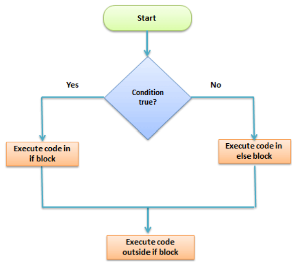 
```

]

---
```{r}
#Realizaremos los siguientes ejemplos (seguir la correcta estructura):
cantidad <-50
if (cantidad >30) {
	print ("Tú vendiste mucho!")
} else {
	print ("No fue suficiente hoy")
} 

cantidad <-80
if (cantidad<50) {
	print("No fue suficiente hoy")
} else  if (cantidad>50 & cantidad<=60) {
	print ("Promedio de venta")
} else {
	print("¡Fue un dia maravilloso!")
}
```

---
```{r}
#Realizaremos los siguientes ejemplos (seguir la correcta estructura):
x <- c("yo","engaño","con el curso")
if ("Con el curso" %in% x) {
	print("Con el curso no me va bien")
} else  if ("con el curso" %in% x) {
	print ("Con el curso me va bien")
} else {
	print("Yo fui engañado con este curso")
}

p <- runif (10,0,20)
Vec_Booleano <- p>=14
NumAprob1 <- length(p)-5
NumAprob2 <- length(Vec_Booleano[Vec_Booleano==TRUE])
which(Vec_Booleano)

if (NumAprob1>0){
  p[which(Vec_Booleano)]
   }
```

---
```{r}
#Consultar el help de R:
help("print")
help("%in%")
```

```{r}
#Realizaremos los siguientes ejemplos (seguir la correcta estructura):
p <- runif(100000,0,30)
Vec_Booleano2 <- p>=15
NumAprob1 <-sum(Vec_Booleano2)
NumAprob2 <-length(Vec_Booleano2[Vec_Booleano2==TRUE])
system.time(sum(Vec_Booleano2))
system.time(length(Vec_Booleano2[Vec_Booleano2==TRUE]))
  
```

---

```{r}
#El Ejemplo final:.
#Score <- as.integer(readline("Ingresa tu nota : "))
Score <- 20
if(Score >= 19){
print("Excelente!!")
print("Llevarás el curso tratamiento estadístico GRATIS!!")
} else if (Score >= 16){
print("Felicidades!!")
print("Llevarás el curso tratamiento estadístico pagando 5 soles!!")
} else if (Score>=14){
print("Felicidades!!")
print("Llevarás el curso tratamiento estadístico pagando 50 soles!!")
} else {
print("No has sido elegido !!")
print("Lo sentimos paga el precio completo 5000 soles")
}
```

---
# FOR LOOP

Un **for loop** es muy útil cuando necesitamos itinerar sobre una lista de elementos o un  rango de números. Loops pueden usarse para itinerar sobre una lista, dataframe, vector, matriz o cualquier otro objeto. 

.pull-left[
```{r, eval = FALSE}
for ( i in vector) {
	Expr1 (bloque de código)
}
i: <variable>
Vector: <objeto iterable>

#Ejemplo sencillo:
for ( i in 1:5) {
	print(i)
}
y <- c(1:5)
for ( x in 1:5) {
 w<-y**x
}

```
]

.pull-right[
```{r, out.width = '100%',echo=FALSE, fig.cap="FOR LOOP ", fig.align='center'}
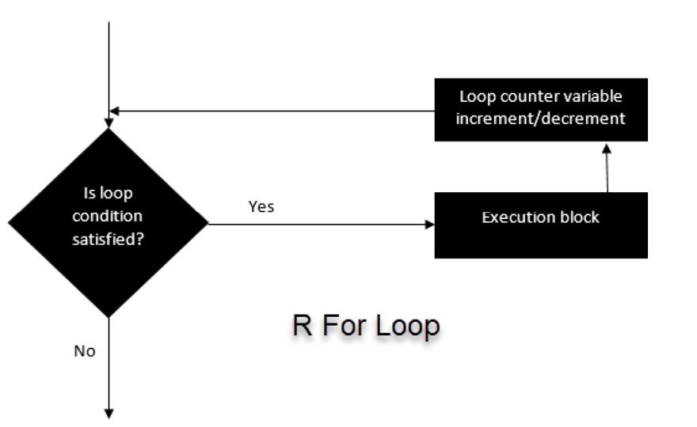 
```
]
---

.pull-left[
```{r}
fruta<-c("Manzana","Naranja","Melocotón","Plátano")
for (i in fruta){
print(i)
}

fruit <-list(Caja = c("Manzana","Naranja","Melocotón","Plátano"), dinero=c(10,12,15), compra=FALSE)
for (p in fruit){
print(p)
}
```
]

.pull-right[
```{r}
lista <-c()
for (i in seq(1,4,by=1)){
lista[[i]]<-i*i
}
print(lista)
```
]

El uso de for loop es muy valuable cuando se llevan tareas de **machine learning**. Después que tenemos un modelo de entrenamiento, necesitamos regularizar el modelo para el ajuste. Esta regularización es una tarea muy tediosa porque necesitamos encontrar el valor para el cual la pérdida de la función sea mínima. Para ayudarnos a detectar estos valores, podemos hacer uso de *for loop* para itinerar sobre un rango de valores y definir el mejor candidato.

---

.pull-left[
```{r}
#Otros ejemplos:
matriz<-matrix(data=seq(9,20,by=1), nrow=6, ncol=2)
 for (r in 1:nrow(matriz)) {
 	 for (c in 1:ncol(matriz)) {
		 print(paste("Row",r,"and columna",c, "have values of", matriz[r,c])) }}
```
]

.pull-right[
```{r}
print (paste ("The year is", 2010))
print (paste ("The year is", 2011))
print (paste ("The year is", 2012))
print (paste ("The year is", 2013))
print (paste ("The year is", 2014))
print (paste ("The year is", 2015))
```
]

---

.pull-left[
```{r}
for (year in c(2010,2011,2012,2013,2014,2015)){
 	print (paste ("The year is", year))
 }

for (year in 2010:2015){
 print (paste ("The year is", year))
 }

```
]

.pull-right[
 El uso de for loop es ayuda al principio de lenguaje de programación : **DRY (Do not Repeat Yourself)** con lo cual el código se hace más eficiente.
¿Cómo leemos las líneas de for loop?

# Consultar el help de R:
help(“paste”)	
]

---

.pull-left[
```{r}
#Otros ejemplos:
x <- c("a","b","c","d")
seq_along(x)
for (i in seq_along(x)){
print(x[i])
}
```
]

#Consultar el help de R:
help(“seq_along”)	

.pull-right[
```{r}
x <- matrix(1:6,2,3)
 for (i in seq_len(nrow(x))){
  for (j in seq_len(ncol(x))){
print (x[i,j])
}
}

```
]

---

# WHILE

Un **loop** que es para mantener corriendo el código desde que la condición es satisfecha, en otras palabras, si es verdadera la condición se entra al cuerpo del bucle.

.pull-left[
```{r, eval=FALSE}
#La sentencia tiene la siguiente estructura:
1 while ( <condicion>) {
2	Expr1 (bloque de código)
3 }

#Ejemplo sencillo:
1 count<-0
2 while (count<10){
3 print(count)
4 count<-count+1
5 }

1 Comenzar<-1
2 while (Comenzar<=10){
3 cat(“Este es un loop número”, Comenzar)
4 Comenzar<-Comenzar+1
5 print(Comenzar)
6 }

```
]

.pull-right[
```{r, out.width = '70%', out.height='70%',echo=FALSE, fig.cap="WHILE LOOP ", fig.align='center'}
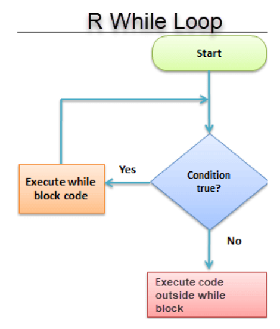 
```
]

---

.pull-left[
```{r}
set.seed(123)
stock <- 50
precio <- 50
loop <- 1
while(precio > 45){
precio<-stock+sample(-10:10, 1)
loop <- loop + 1
print(loop)
}
cat("it took",loop,"loop before we short the Price.", "The lowest Price is", precio)
```
]

# Consultar el help de R:

```{r, eval=FALSE}
help("set.seed()")
help("cat()")
```

---

# SWITCH

Este comando permite **ejecutar un bloque de código distinto** en función del valor de una variable.

.pull-left[
```{r, eval=FALSE}
#La sentencia tiene la siguiente estructura:
1 switch ( <Expr> ,
2 <valor_1>{
3 # código
4 },
5 …
6 <valor_n>{
7 #codigo
8 }
9 ) #Termina switch
```
]

.pull-right[
```{r}
#Ejemplo sencillo:
 x <- 1:10
 type <- "mean"
 switch(type,
 mean = mean(x),
 median = median(x),
 sd = sd(x)
 )
```
]

---

```{r}

x <- as.integer(2)
z <- switch(x,1,2,3,4,5)
z
x <- 3.5
z <- switch(x,1,2,3,4,5)
z
y <- rnorm(5)
x <- "sd"
z <- switch(x,"mean"= mean(y),"median"= median(y),"variance"= var(y),"sd"=sd(y))
z
x <- "median"
z <- switch(x,"mean"= mean(y), "median"= median(y),"variance"= var(y), "sd"=sd(y))
z

```

---
# REPEAT

La estructura **repeat** ejecuta un bucle infinitamente. En general no es utilizada para realizar análisis, sino cuando se realiza programación. La única forma de terminar con el bucle es llamando dentro de esta a la función break.

```{r, eval=FALSE}
#La sentencia tiene la siguiente estructura:
1 repeat(<condición>){
2 #código
3 …
4 }

```

```{r}
#Ejemplo sencillo:
 count<-0
 repeat{
 print(count)
 count <- count+1
 if(count==2) break
 }

```


---

# Next/Break

La función **next** es utilizada para terminar un ciclo del bucle en ejecución y pasar al siguiente. Por ejemplo, si estamos dentro de un *bucle FOR* lo que sucedería al momento de ejecutar la función `next` es que se salta directo al siguiente elemento sobre el que está iterando. Por otro lado, la función break es usada para detener el bucle y salir de él inmediatamente.

```{r}
#Imprimir en la pantalla los números del 2,4,6 y 8
 for( i in 1:10){
 if( i %%2 == 0) next
 print (i)					
 }
#Pondremos el ejemplo para imprimir los números impares entre 1 y 10, pero que los pares no se vean:
 for( i in 1:10){
 if (!i %% 2){
   next
 }
   print(i)
 }
#Ahora usaremos la función break
for ( i in mtcars$mpg){
print(i)
if(i<15) break
}

```

#Consultar el help de R:

```{r}
help("help()")
help("data()")
```

---

```{r}
# Contar los números pares de un vector
x <- c(2,5,3,9,8,11,6)
count <- 0
for (val in x){
    if (val %% 2 ==0)
 count = count + 1
}
  print(count)

#Imprimir nuestra famosa tabla de multiplicar
 num = as.integer(readline("Ingrese un numero:  "))
 for (i in 1:10){
 print(paste(num,"x",i,"=",num*i))
 }

```

---

```{r, eval=FALSE}
# Calculemos el factorial de un número entero
num = as.integer(readline("Ingrese un numero entero: "))
factorial = 1
if(num<0){
   print("El numero ingresado debe ser positivo")
 } else if (num==0){
 print("Por definición, el factorial de 1 es 0")
 } else {
 for (i in 1:num){
 factorial = factorial * i
 }
 print(paste("El factorial de", num, "es", factorial))
 }
```

---
```{r, eval=FALSE}
# Verificador de números primos
 num = as.integer(readline("Ingrese un numero : "))
 flag=0
 if(num>1){
   flag=1
 for(i in 2:(num-1)){
   if((num%%i) == 0){
   flag=0
   break
   }}}
 if(num ==2) flag =1
 if(flag ==1){
 print(paste(num,"es un numero primo"))
 } else {
 print(paste(num, "No es un numero primo"))
 } 
# Probar con el número: 3,5,7,23,2305843009213693951
```

---
background-image: url("fotos/Descanso.jpg")
background-size: cover
class: right, bottom, inverse

# Volvemos en 3 limones!

---
class: inverse, middle, center

# Factores - Listas en R

---

# Factores R

Factores son **variables en R** las cuales toman un número límite de diferentes valores; tales variables usualmente referidas como una *variable categórica*.

En los dataset, podemos distingue dos tipos de variables categóricas: `categórica y continua`.
* En variables categóricas, los valores están limitados y usualmente en un grupo finito en particular.
* En variables continuas, sin embargo, pueden tomar cualquier valor, desde un entero a decimal. Por ejemplo. Podemos tener ingresos, precios de venta, etc.

*Variables Categóricas:* R almacena variables categóricas en un factor. Veamos el código siguiente para convertir un a variable categórica en un factor variable. Caracteres no son soportados en algoritmos de `machine learning` , y la única forma es convertirlos a string o en integer.

$$factor(x = caracter(), levels, labels = levels, ordered=is.ordered(x))$$
Argumentos:

`x` =  Un vector de data. Necesita ser un string o integer, no decimal.
levels = Un vector de posibles valores tomados por x. Este argumento es opcional. El valor por defecto es la única lista de ítems del vector.
`labels` = Agregar una etiqueta a la data x. Por ejemplo, 1 puede tomar la etiqueta “hombre” mientras 0 la etiqueta “mujer”.
`ordered` = Determina si los niveles deberán ser ordenados.	

---


```{r}
vec_genero<-c("Male","Female","Female","Male","Male")  	# Creamos un vector genero.
class (vec_genero)					# Vemos la clase del vector.
factor_vec_genero<-factor(vec_genero)
class(factor_vec_genero) 
```

Es importante transformar un string en un factor cuando llevamos acabo una tarea de machine learning. Una variable *categórica* puede ser dividida en una variable **nominal** categórica y variable **ordinal** categórica.

*Variable Categórica Nominal:* posee muchos valores pero el orden no importa. Por ejemplo, hombre y mujer categóricas variables no tienen un orden.

```{r}
vector_color <- c("azul","rojo","verde","blanco","negro","amarillo") # Creamos un vector color.
factor_color <- factor(vector_color)				# Convertimos el vector a factor.
factor_color #Revisar la salida (output) !
```

---

`Variable Categórica Ordinal`: poseen un orden natural. Nosotros podemos especificar el orden , desde el menor a el mayor con order = TRUE y del mayor al menor con order = FALSE.

```{r}
vec_dia <- c("evening", "morning", "afternoon", "midday", "midnight", "evening")  # Creamos un vector ordinal.
factor_dia <- c(vec_dia, order = TRUE, levels = c("morning","midday","afternoon","evening","midnight"))					# Convertimos el vec_dia a un factor con niveles de orden
factor_dia 			# Imprimir o correr la variable.
# Observar la salida (output)!
# R ordena los niveles desde “morning” a “midnight” como específicos en los niveles entre paréntesis.
```

`Variables Continuas:` La clase variable continua son valores por defecto en R. Ellas son almacenadas como numeric o integer. Podemos ver desde el dataset  siguiente mtcars (dataset  construido en R). Este reúne informacipon de diferentes tipos de carros. Nosotros podemos importar usando mtcars y revisando la clase de la variable mpg, mile per gallon. Esto nos returna un valor numérico, indicándonos una variable continua.

```{r}
dataset <- mtcars
class(dataset)
```

---

# Listas en R

Una lista es una gran herramienta para *almacenar variedad de tipos de objetos* en el orden esperado. Nosotros podemos incluir matrices, vectores, dataframe o listas. Imaginemos una lista como una maleta grande en la cual queremos poner muchos diferentes ítems. Cuando necesitamos usar un ítem, abrimos la maleta y lo usamos. Una lista es similar, podemos almacenar una colección de objetos y usarlos luego cuando sean necesarios.

Empezaremos creando una lista con la siguiente función:
$$list(element_1, …)$$
`Argumentos:`

*element_1  = * almacenar cualquier tipo de objeto en R.
*… 	        = * poner tantos objetos como se necesite. Cada objeto necesita estar separado por una coma.

Crearemos diferentes objetos, un vector, una matriz y un dataframe. 

```{r}
vec <- 1:5					# Creamos un vector genero.
mat <- matrix(1:10, ncol=5)				# Creamos una matriz.
df  <- EuStockMarkets[1:10, ] 	# Seleccionamos las 10 filas del dataset construido en R EuStockMarkets
mi_lista <- list(vec, mat, df) 				# Creamos la lista con los tres objetos.

```

---

`Seleccionar Elementos de la Lista:` Después de construir nuestra lista, podemos acceder muy fácil. Necesitamos usar el [[index]] seleccionar un elemento desde en una lista. El valor interno del doble corchete representa la posición del ítem en una lista que deseamos extraer. Por ejemplo, pondremos el número 2 dentro de los corchetes, R nos devolverá el segundo elemento listado.

```{r}
mi_lista[[2]]					# Elegimos el elemento 2 de la lista
#Probemos con el elemento 1 y 2.

```

---

# PRACTICAR!

Revisar dentro de :

```r
4.MaterialExtra/ejerciciosauxiliares/02Dataframe_Factores_Listas.r

&

Solo correré el código, ustedes practiquenlo detallado.

4.MaterialExtra/ejerciciosauxiliares/04.1Clase_Graficos.R

4.MaterialExtra/ejerciciosauxiliares/04.2Graficos_Final.R

```


---

class: inverse, middle, center

# Paqueteria de Funciones
---
#  Definición de Funciones

Una función, en un ambiente de programación, es un **conjunto de instrucciones**. Un programador o practicante de programador construye una función evitando repetir la misma tarea, o reducir complejidad. Una función debe ser : *(1) escrita con para llevar a cabo una tarea específica*, *(2) puede o no puede incluir argumentos*, *(3) contener un cuerpo* y *(4) puede o no retornar más valores*. Un general aprovechamiento de las funciones es para usar argumentos como entradas (inputs), alimentar parte del cuerpo y finalmente retornar una salida (output). La escritura de la función es la siguiente:

```{r, eval=FALSE}
#La sentencia tiene la siguiente estructura:
1 function (arglist) {
	#Function body
}

#Para escribir la función necesitamos nombre, argumentos y un cuerpo, ejemplo:
 1 function.name <- function(arguments) {
	computations on the arguments
	some other code
}

```
---

```{r}
#Funciones de un argumento (Crearemos una función que se llame eleva al cuadrado)
square_function<-function(n)
{
	# compute the square fo integer “n”
	n^2
} 
#Llamaremos a la función y asignaremos valore de 4
square_function(4)

#Algo importante a considera es que nosotros no explicamos el tipo de variable por ende el programa #lo entiende como un entero, vector o matriz. Si deseamos borrar la función solo ponemos

rm(square_function)

#Funciones en R definición:
es.par<-function(numero){
residuo<-numero%%2
 if(residuo==0)
 	return(TRUE)
 	return(FALSE)
}

#Evaluamos:
es.par(14)
es.par(17)
```
---

**Tipos de Funciones:** En general hemos revisado en lo que va del curso funciones Generales, Matemáticas y Estadísticas propiamente dichas.
`Funciones Generales:` Como ejemplos tenemos las funciones familiarizadas de cbind(), rbind(), range(), sort(), order(), diff(), length() functions.
`Funciones Matemáticas:`  Como parte de estas funciones tenemos valor absoluto (abs(x)), logaritmo de x en base y (log(x, base=y)), exponencial de x (exp(x)), raíz cuadrad de x (sqrt(x)), factorial de x (fac(x)) entre otras.
`Funciones Estadísticas:` Como parte de estas funciones tenemos media aritmética de x (mean(x)), mediana de x (median(x)), varianza de x (var(x)), desviación estándar de x (sd(x)), valores estándar (z-valores) de x (scale(x)), los cuantiles de x (quantile(x)), el sumario de x (summary(x)).

**Alcance del Environment**
En R, el ambiente (environment) es una colección de objetos como funciones, variables, data frame, etc. R abre el ambiente cada vez que Rstudio es ejecutado. La parte más alta de este ambiente está disponible en global environment, llamado R_GlobalEnv. Y nosotros además tenemos un local environment. Nosotros podemos listar el contenido de nuestro actual ambiente con : `ls(environment())` y con `rm(list=ls())` se eliminan todas las variables del enviromment.

```{r}
#Realizaremos los siguientes códigos para
#poder entender mejor lo anterior:
y<-10
f<-function(x){
	x+y}
f(5)
```
---

.pull-left[
```{r}
#Luego
f<-function(x){
 	y<-10
	x+y
} 
f(5)

#Finalmente
y <-2
f <- function(x){
y <- 4
x+y
 }
f(5)
```
]

.pull-right[
```{r}
#Ejemplo más estructurado:
es.divisible.por <-function(entero.grande, entero.chico){
 if(entero.grande %% entero.chico!=0)
 	return(FALSE)
          return(TRUE)
}
es.divisible.por(15,6); es.divisible.por(15,5)

#Reescribiéndo la función es.par de manera más simple con lo creado anteriormente:
es.par <- function(num){
es.divisible.por(num,2)
}

```
]

---
# Aplicación de Funciones

Las funciones conocidas dentro del entorno R son  *apply*, *lapply*, **sapply**, **tapply**, *mapply* y *vapply*. Sin embargo, más adelante se utilizara [tidyverse](https://www.tidyverse.org) que tiene toda esta potencialidad incorporada.

* `Apply:` Aplica una función a una matriz, lista o vector que se le pase como parámetro.
El código presenta la siguiente estructura:
$$apply(x, MARGIN, FUN)$$

*Argumentos:*

`x =` Un arreglo o matriz.
`MARGIN =` tomo un valor o un rango entre 1 y 2 para definir donde aplicar la función:
`MARGIN=1 :` la manipulación trabaja en las filas.
`MARGIN=2 :` la manipulación trabaja en las columnas.
`MARGIN=c(1,2) :` la manipulación trabaja en filas y columnas.
`FUN=`nos indica las funciones que vamos a aplicar. Construir funciones como mean, median, sum, min, max e incluso funciones creadas por el usuario pueden ser aplicadas.

---
.pull-left[
```{r}
#Realizaremos los siguientes códigos 
#para poder entender lo anterior:
mi_matriz <- matrix(1:9,nrow=3,ncol=3)
apply(mi_matriz, 2, sum)
apply(mi_matriz,1, sum)
apply(mi_matriz, c(1,2),mean)
```
]

.pull-right[
```{r}
#Otro ejemplo
m1 <- matrix(c<-(1:10), nrow=5,ncol=6)
m1
a_m1 <- apply(m1,2,sum)
a_m1
m1[a_m1]

```
]
---
* `Lapply:` Se diferencia con apply en que opera con listas. Recibe una lista y devuelve una lista.
El código presenta la siguiente estructura:
$$lapply(x, FUN)$$

*Argumentos:*

`x =` Un vector o un objeto.
`FUN =` función aplicada para cada elemento de x.

.pull-left[
```{r}
#Realizaremos los siguientes códigos para poder entender lo anterior:
movies<-c("SPIDERMAN","BATMAN","VERTIGO","CHINATOWN")
movies_lower<-lapply(movies,tolower)
str(movies_lower)
movies_lower<-unlist(lapply(movies,tolower)) #Para convertir la lista en vector.
```
]

```{r}
#Otro ejemplo
P<-matrix(1:9, nrow=3, ncol=3)
Q<-matrix(11:19, nrow=3, ncol=3)
R<-matrix(21:29, nrow=3, ncol=3)
mi_lista<-list(P,Q,R)
lapply(mi_lista, "[",1,1)

```

---
```{r, eval=FALSE}
#Podemos intercambiar lapply() y sapply() para cortar un data frame. 
below_ave <- function(x){
      ave <- mean(x)
      return(x[x>ave])
}
dt_s <- sapply(dt, below_ave)
dt_l <- lapply(dt, below_ave)
identical(dt_s,dt_l)

```

* `Tapply:` Realiza una operación (parámetro 3) respecto a un vector (parámetro 1) agrupada por los factores que e indiquen como argumento (parámetro 2).
El código presenta la siguiente estructura:
$$tapply(x, INDEX, FUN)$$

*Argumentos:*

`x =` Un objeto, usualmente un vector.

`INDEX=` Una lista conteniendo factores.

`FUN=` Función aplicada a cada elemento de x.

---

```{r}
#Realizaremos los siguientes códigos para poder entender lo anterior (ejemplo iris data frame):
data(iris)
tapply(iris$Sepal.Width,iris$Species, median)
#Otro ejemplo
x <- 1:20
y <- factor(rep(letters[1:5],each=4))
tapply(x, y, sum)

```

---
.pull-left[
* `Mapply:` Realiza operaciones entre matrices y devuelve una lista o vector, a continuación se muestran algunas de las operaciones que admite.

```{r}
#Suma el primer elemento de cada vector, después el segundo y así sucesivamente:
mapply(sum, 1:5, 1:5, 1:5)
#Repite cada elemento del primer vector el número de veces que indique el segundo vector:
mapply(rep, 1:4, 4:1)
```
]

.pull-right[
* `Vapply:` Devuelve un vector con la longitud que tiene cada una de las listas introducidas como parámetro.

```{r}
x <- list(A=1,B=1:3,C=1:7)
vapply(x, FUN= length, FUN.VALUE=0L)

```
]

---
class: inverse, middle, center

# Administración de Paquetes e Instalación
---

**Librerias:**

R viene con un conjunto de características por defecto, tales como códigos básicos desarrollados, plantillas generales de trabajo, no obstante, las características de mayor ayuda corresponden a *módulos opcionales que se pueden descargar de la web e instalar en R*. Existen cientos de miles de paquetes los cuales tienen una amplia variedad de tópicos de área de toda índole, económica, ingeniería, ciencia, etc. Por lo cual debemos entender primero *que es un paquete*, **son colecciones de funciones en R**. Por ejemplo, la función `library()` muestra la lista de paquetes guardados en la librería. R, como se menciono anteriormente, viene con un conjunto de paquetes por default (stats, graphics, utils, methods y otros), ellos provienen de un rango de funciones y conjunto de datos que están disponibles de forma determinada. El comando `search()` indica que paquetes están cargados y listos a usar, por ejemplo:

```{r}
#usar la funcion 
search()
```

---
# CRAN (Comprehensive R Archive Network)

CRAN es una red de servidores ftp y web en todo el mundo que almacena versiones idénticas y actualizadas de código y documentación para R. Siempre es bueno utilizar el espejo CRAN más cercano para minimizar la carga de la red en la instalación de paquetes. Para instalar paquetes desde [CRAN](https://cran.r-project.org) podemos hacerlo de dos formas. No olvidar instalar primero [Rtools](https://cran.r-project.org/bin/windows/Rtools/).

```{r, eval=FALSE}
install.packages("tidyverse") #<<
library(tidyverse)
```

- Abrir Rstudio `Tools -> Install Packages -> Name Package -> Install`;<sup>1</sup>

Lista de paquetes importantes a instalar:

Ver https://roelverbelen.netlify.app/resources/r/packages/.

---
# GitHub (Internet hosting for software development)

[Github](https://github.com) es un proveedor de alojamiento de Internet para el desarrollo de software y el control de versiones mediante Git. Ofrece el control de versiones distribuido y la funcionalidad de administración de código fuente de Git, además de sus propias características. Millones de desarrolladores y compañias construyen, interactuan y mantienen su softwareen GitHub - es a más grande y más avanzada plataforma de desarrollo en mundo. Creada inicialmente por **Chris Wanstrath, P. J. Hyett, Tom Preston-Werner and Scott Chacon** usando Ruby on Rails, y comenzo en Febrero del 2008. Para instalar paquetes desde GitHub:

```{r, eval =FALSE}
install.packages("remotes", "devtools")
library(remotes)
library(devtools)
install_github("AotinianoZ/foofactors")
library(foofactors)
```

Revisar https://github.com/AotinianoZ/foofactors.

---
# Bioconductor(Open Source Software for Bioinformatics)

[Bioconductor](https://www.bioconductor.org) proporciona herramientas para el análisis y la comprensión de datos genómicos de alto rendimiento. Bioconductor utiliza el lenguaje de programación estadístico R y es de código abierto y desarrollo abierto. Tiene dos lanzamientos cada año y una comunidad de usuarios activa. Bioconductor también está disponible como [AMI (Imagen de máquina de Amazon)](https://www.bioconductor.org/help/bioconductor-cloud-ami/) e imágenes de [Docker](https://www.bioconductor.org/help/docker/).

```{r, eval =FALSE}
# Infinidad de paquetes auxiliares útilites para ciencia de datos.
install.packages("BiocManager")
library(BiocManager)
```

---
# Bibliografía Adicional:

La bibliografía para comenzar en el fascinante mundo de R es:

* R for Data Science, ver [R4DS](https://r4ds.had.co.nz/index.html), [Hands-On Programming with R](https://rstudio-education.github.io/hopr/).

* Colección de Paquetes Data Science, ver [Tidyverse](https://www.tidyverse.org) y [listado de paquetes](https://roelverbelen.netlify.app/resources/r/packages/).

* Generación de Libros Interactivos, documentos y analisis, ver [R Markdown Cookbook](https://bookdown.org/yihui/rmarkdown-cookbook/), [R Markdown: The Definitive Guide](https://bookdown.org/yihui/rmarkdown/), [bookdown](https://bookdown.org/yihui/bookdown/), [Mastering Shiny](https://mastering-shiny.org), [Interactive web-based data visualization with R, plotly, and shiny](https://plotly-r.com/index.html)

* Rstudio y R, ver [Rstudio](https://www.rstudio.com), [Studio Blog](https://blog.rstudio.com), [useR](https://user2021.r-project.org/blog/).

* Journals - Books, ver [The R Journal](https://journal.r-project.org), [Chapman & Hall/CRC The R Series](https://www.routledge.com/Chapman--HallCRC-The-R-Series/book-series/CRCTHERSER), [Serie Use R](https://www.springer.com/series/6991?detailsPage=titles).

* Machine Learning, ver [Hands-On Machine Learning with R](https://bradleyboehmke.github.io/HOML/).

* Geoquimica, ver [Geochemical Modelling of Igneous Processes – Principles And Recipes in R Language](https://www.springer.com/gp/book/9783662467916), paquetes importantes Geological Survey of Canada - [rgr:Applied Geochemestry Data EDA](https://cran.r-project.org/web/packages/rgr/index.html) y USGS - [GcClust: Clustering regional geochemical data](https://pubs.er.usgs.gov/publication/tm7C13)

* Hidroquimica, ver [CRAN Task View: Hydrological Data and Modeling](https://cran.r-project.org/web/views/Hydrology.html).

---

background-image: url("fotos/Descanso2.jpg")
background-size: cover
class: left, top, inverse

# Terminamos a Descansar!!!

---
class: center

# Avanzando en R y Geociencias (印)

Siempre Adelante


---

class: center, middle

# Thanks!

Slides son creados via el R package [**xaringan**](https://github.com/yihui/xaringan).

El chacra proviene de [remark.js](https://remarkjs.com), [**knitr**](https://yihui.org/knitr/), y [R Markdown](https://rmarkdown.rstudio.com).
