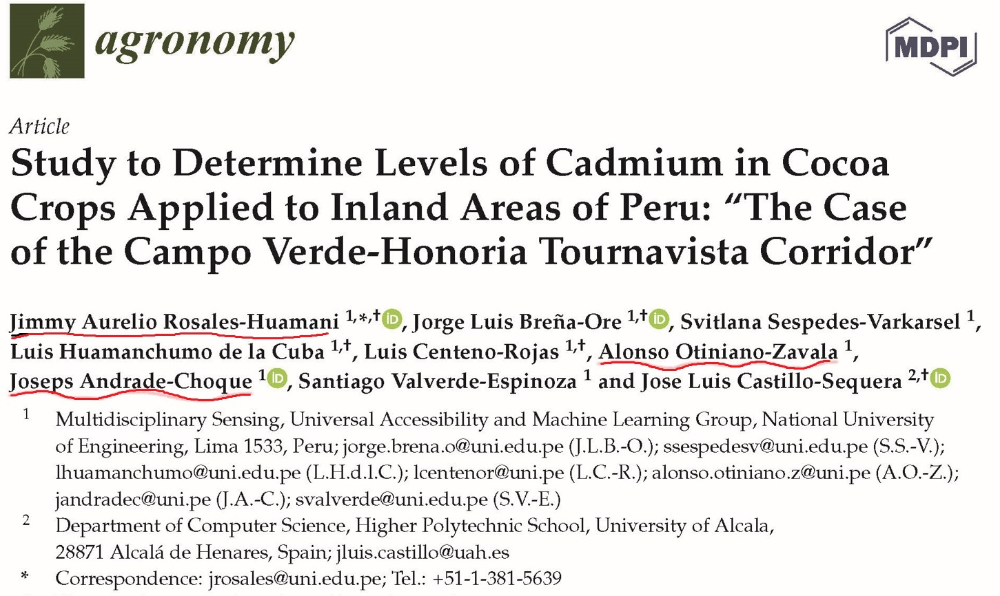
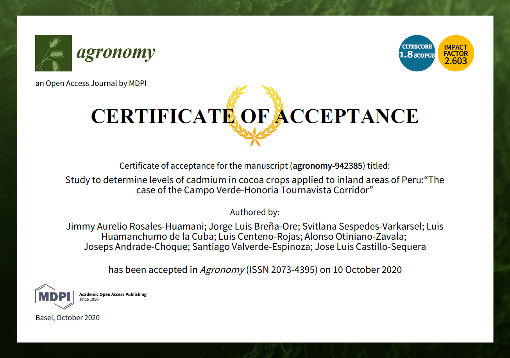

```{r setup, include=FALSE}
knitr::opts_chunk$set(echo = TRUE)
Sys.setenv('MAPBOX_TOKEN' = 'pk.eyJ1IjoiYWxvbnNvMjUiLCJhIjoiY2tveGJseXJpMGNmcDJ3cDhicmZwYmY3MiJ9.SbThU_R8YGE1Zll-nNrZKA')
library(tidyverse);library(corrplot);library(htmltools);library(raster);library(rgdal)
library(mapdeck);library(mapview);library(sf);library(mapedit);library(leaflet.extras)
#ms <- mapdeck_style("satellite")
mapviewOptions(basemaps = "Esri.WorldImagery")
```

```{r, echo=FALSE, eval=FALSE}
# htmltools::img(src = knitr::image_uri(file.path(R.home(""), "html", "logo.jpg")), 
#                alt = 'logo', 
#                style = 'position:absolute; top:0; right:0; padding:10px;')
```

# Publicación Internacional:

Certificado de Aceptacion:

```{r, fig.align="center", fig.cap=c("Study to Determine Levels of Cadmiumin Cocoa Crops Applied to Inland Areas of Peru"), echo=FALSE, fig.align='center'}

```

Paper:

```{r, fig.align="center", fig.cap=c("Acreditation"), echo=FALSE}

```

# Link de Descarga

El link es el siguiente: [Agronomy MDPI](https://www.mdpi.com/2073-4395/10/10/1576).

#  Video de Presentación

El link es el siguiente: [ECITEC UNI 2020](https://youtu.be/_2tM5qMYags)

# Análisis de la Información Recolectada:

## Revisión del Modelo de Elevación Digital:

```{r, fig.align='center'}
DEM <- raster("Data_Suelos/raster/DEM_DRONE/Zona_Oeste.tif")
# str(DEM)
# DEM
# slope <- terrain(DEM, opt ="slope")
# aspect <- terrain(DEM, opt="aspect")
# DEM.hill <- hillShade(slope, aspect, angle = 40, direction = 270)
DEM <- crop(DEM, extent(518600, 519200, 9031800, 9032400))
#plot(DEM, main = "Drone - Digital Elevation Model (DEM)", col = topo.colors(20),
#     zlim=c(0, 250))
image(DEM, main = "Drone - Digital Elevation Model (DEM)", col = topo.colors(20),
      zlim=c(0, 250))
```

## Revisión del DEM con factores:

```{r, warning=FALSE, message=FALSE}
Factores_cacao <- st_read(dsn = "Data_Suelos/shp/Cacao_Factors/Age_Planta.shp")
mapview(Factores_cacao)
```

```{r}
mapview(DEM, legend =TRUE)+
  mapview(Factores_cacao, alpha.regions = 0.01 , legend.opacity = 0.10, 
         lwd = 2, color = "blue")
```


## Generando Shapefiles (Opcional):

```{r, fig.align='center', warning=FALSE, message=FALSE}
Factores_cacao2 <- as.data.frame(Factores_cacao)
#Factores_cacao2$Uso_Tierra <- edit(Factores_cacao2$Uso_Tierra)

Factores_cacao2$Var_cocoa <- c("Creole-Aromatic","CCN51","","CCN51","Creole-Aromatic",
                               "CCN51")
Factores_cacao3 <- st_as_sf(Factores_cacao2)

mapview(Factores_cacao3, zcol="Var_cocoa")
```


```{r, warning=FALSE, message=FALSE}
Honoria_elementos <- readxl::read_xlsx(path = "Data_Suelos/csv_xlsx_txt/BD_Cd.xlsx")
str(Honoria_elementos)
Honoria_elementos <- Honoria_elementos %>% rename(Este= Xeast, Norte=Ynorth, 
                                                  Cd = Cdsoil_mgkg,
                                                  Pb = Pbsoil_mgkg,
                                                  Zn = Znsoil_mgkg,
                                                  pH = pHapprox,
                                                  Ce = Ceapprox_uS_cm)
Honoria_elementos2 <-Honoria_elementos[ ,c("Norte","Este")]
Honoria_elementos2 <- Honoria_elementos2[ ,order(c(names(Honoria_elementos2)))]
sputm  <- SpatialPoints(Honoria_elementos2, proj4string=CRS("+proj=utm +zone=18 +south +datum=WGS84")) 
spgeo  <- spTransform(sputm, CRS("+proj=longlat +datum=WGS84"))
spgeo  <- as.data.frame(spgeo)
colnames(spgeo) <- c("lng","lat")
Honoria_elementos2 <- cbind(Honoria_elementos,spgeo)

Honoria_elementos3 <- st_as_sf(Honoria_elementos2, coords = c("lng", "lat"),
                               remove = FALSE, crs = 4326, agr = "constant")

mapview(Honoria_elementos3, zcol = "Cd") +mapview(Factores_cacao3, zcol="Var_cocoa")+
  mapview(Factores_cacao3, zcol = "Uso_Tierra")+
  mapview(Factores_cacao3, zcol = "Age")

Factores_cacao4 <- Factores_cacao3 %>%
  st_transform(crs = 4326 )
  
Honoria_elementos3 %>%
  st_intersection(Factores_cacao4) %>%
  mapview(zcol = "Uso_Tierra", burst = TRUE, cex = "Cd")+
  mapview(Factores_cacao, alpha.regions = 0.01 , legend.opacity = 0.10, 
          lwd = 2, color = "blue")
Honoria_elementos3 %>%
  st_intersection(Factores_cacao4) %>%
  mapview(zcol = "Age", burst = TRUE, cex = "Cd" )+
  mapview(Factores_cacao, alpha.regions = 0.01 , legend.opacity = 0.10, 
          lwd = 2, color = "blue")
Honoria_elementos3 %>%
  st_intersection(Factores_cacao4) %>%
  mapview(zcol = "Var_cocoa", burst = TRUE, cex = "Cd")+
  mapview(Factores_cacao, alpha.regions = 0.01 , legend.opacity = 0.10, 
          lwd = 2, color = "blue")
```

### Estandar de Calidad de Cd en Suelos:
$$Cd<=1.4$$

```{r, fig.align='center', warning=FALSE, message=FALSE}
mapview(Honoria_elementos3, zcol = "Cd", at = c(0,1.4,2.5), legend = TRUE,
         col.regions = c("green", "red"))+
  mapview(Factores_cacao, alpha.regions = 0.01 , legend.opacity = 0.10, 
          lwd = 2, color = "blue")
```

# Data Table:

```{r, fig.align='center', warning=FALSE, message=FALSE}
Factores_cacao_n <- Factores_cacao 
Honoria_elementos_n <- Honoria_elementos3 %>% st_transform(crs = st_crs(Factores_cacao))
# sf_use_s2(TRUE) #cambiar a spherical geometry
intersection <- st_intersection(Honoria_elementos_n, Factores_cacao_n)
intersection
```

```{r, fig.align='center', warning=FALSE, message=FALSE}
Honoria_statical <- intersection %>% st_set_geometry(NULL)
```

# Statical Summary:

```{r, fig.align='center', warning=FALSE, message=FALSE}
min_max_mean_sd <- list(
  min = ~min(.x, na.rm = TRUE),
  max = ~max(.x, na.rm = TRUE),
  mean = ~mean(.x, na.rm = TRUE),
  sd = ~sd(.x, na.rm = TRUE)
)

```

```{r, fig.align='center', warning=FALSE, message=FALSE}
Honoria_statical %>% 
  summarise(across(c(Cd, Pb, Zn, pH, Ce), min_max_mean_sd))
```

```{r, fig.align='center', warning=FALSE, message=FALSE}
Honoria_statical %>% group_by(Age) %>% 
  summarise(across(c(Cd, Pb, Zn, pH, Ce), min_max_mean_sd))
```

Ver `vignette("colwise")` para más detalles.

# Boxplot Analysis:

## Cd total:

```{r, fig.align='center', warning=FALSE, message=FALSE}
ggplot(data = Honoria_statical)+
  geom_boxplot(mapping = aes(x = Cd))+
  coord_flip()
```

## Cd by Factor Age and Land Use:

```{r, fig.align='center', warning=FALSE, message=FALSE}
ggplot(data = Honoria_statical)+
  geom_boxplot(mapping = aes(x = Cd))+
  facet_grid(. ~ Age)+
  coord_flip()
```

```{r, fig.align='center', warning=FALSE, message=FALSE}
ggplot(data = Honoria_statical)+
  geom_boxplot(mapping = aes(x = Cd))+
  facet_grid(. ~ Uso_Tierra)+
  coord_flip()
```

## Cd by Prior Exploration Field:

```{r, fig.align='center', warning=FALSE, message=FALSE}
ggplot(data = Honoria_statical)+
  geom_boxplot(mapping = aes(x = Cd))+
  facet_grid(. ~ Uso_Tierra)+
  coord_flip()
```

# Average Cadmiunm Soil

# Corrplot Bivariant

```{r, fig.align='center', warning=FALSE, message=FALSE}
correlacion <- cor(Honoria_statical[ ,c("Cd", "Pb", "Zn", "pH", "Ce")]
                   , method = "pearson")
corrplot(correlacion, method ="circle", diag = TRUE, title= "Correlacion de Pearson Honoria", 
         hclust.method = "median", addrect = 2)
corrplot(correlacion, method ="circle", diag = TRUE, title= "Correlacion de Pearson Honoria")
         
```

```{r, fig.align='center', warning=FALSE, message=FALSE}
correlacion2 <- cor(Honoria_statical[ Honoria_statical$Uso_Tierra=="Maiz 10", c("Cd", "Pb", "Zn", "pH", "Ce")], method = "pearson")
# correlacion2 <- cor(Honoria_statical %>% filter(Uso_Tierra=="Maiz 10") %>%
#                     select(Cd, Pb, Zn, pH, Ce), method = "pearson")
corrplot(correlacion2, method ="number")
corrplot(correlacion2, method ="circle", order = "AOE")
corrplot(correlacion2, method = 'shade', order = 'AOE', diag = FALSE) 
corrplot(correlacion2, method = 'square', order = 'AOE', diag = FALSE, type = "lower")
```

```{r, fig.align='center', warning=FALSE, message=FALSE}
correlacion3 <- cor(Honoria_statical[Honoria_statical$Uso_Tierra=="Pasto 10", c("Cd", "Pb", "Zn", "pH", "Ce")], method = "pearson")
corrplot(correlacion3, method ="circle")
corrplot.mixed(correlacion3, order = 'AOE')
```

Para ver toda la funcionalidad revisar : [An Introduction to corrplot Package](https://cran.r-project.org/web/packages/corrplot/vignettes/corrplot-intro.html).

# Biplot Multivariant (Principal Component Analysis)

## Preparacion de la informacion

```{r}
library(FactoMineR); library(factoextra)
Honoria_pca_var <- Honoria_statical 
Honoria_pca <- Honoria_pca_var %>% dplyr::select(Cd, Pb, Zn, pH, Ce)
```

## Usando la funcion `prcomp()`

```{r}
res.pca <- prcomp(Honoria_pca, scale = TRUE)
res.pca <- PCA(Honoria_pca, graph=FALSE)
print(res.pca)
res.pca$call$centre
```

## Eigenvalores

```{r}
# La varianza explicada por el primer eigenvalor es 38.60% y el segundo 25.58% los cuales
# seran tomados para el analisis de los componentes principales representando 64.19% de la
# varianza total. Según (Kaiser 1961) un eigenvalue>1 indica un punto de corte 
# para contener el deja a voluntad del investigador realizar el corte en un valor adecuado
# para la visualizacion. 
eig.val<- get_eigenvalue(res.pca)
eig.val
fviz_eig(res.pca, addlabels = TRUE, ylim=c(0,50))
```

## Circulo de correlacion

```{r}
var <-get_pca_var(res.pca)
var
#Circulo de Correlacion:
#La correlacion entre las variables de los componentes principales son usadas como
# coordenadas de la variable para los PC. Segun esto las observaciones son representadas
# por su proyeccion, pero las variables son representadas por sus correlaciones.
var$coord
fviz_pca_var(res.pca, col.var="black")

fviz_pca_var(res.pca, col.var = "cos2",
             gradient.cols=c("#00AFBB","#E7B800","#FC4E07"),
             repel=TRUE)
# El plot de correlacion nos indica que las variables pH y Ce estan correlacionadas
# positivamente (agrupadas), asi como el Cd, Pb. Las variables Cd-Zn y Pb-Zn tienen
# una correlación inversa, mientras que entre ph-Zn y Ce-Zn no existe una relacion
# significativa.

# Las variables pH, Ce, Pb y Cd estan bien representadas, adicionalmente
# se debe notar que el Zn disminuye su representatividad.
```

## Contribucion de PCA

```{r}
fviz_cos2(res.pca, choice="var",axes=1:2, top=10)
fviz_contrib(res.pca, choice="var",axis=1,top=10)
fviz_contrib(res.pca, choice="var",axis=2,top=10)
# La representatividad de la proyeccion para el Zn no es considerablemente
# significativa para las 
# Dimensiones 1 y 2, porque el angulo de proyeccion es muy alto por lo cual no 
# se proyecta de la manera deseada.
```

## Correlacion y p-valores

```{r}
res.desc <- dimdesc(res.pca, axes=c(1,2),proba=0.05)
res.desc$Dim.1
res.desc$Dim.2
```

## Indicadores y Graficos PCA:

```{r}
ind <- get_pca_ind(res.pca)
ind

fviz_pca_ind(res.pca, col.ind="cos2",
             gradient.cols=c("#00AFBB","#E7B800","#FC4E07"),
             repel=TRUE)

fviz_contrib(res.pca, choice="ind", axes=1:2) #Contribucion puntual


fviz_pca_ind(res.pca,
             geom.ind = "point",
             col.ind = Honoria_pca_var$Age,
             palette = rainbow(6),
             addEllipses = TRUE,
             legend.title="Age")
fviz_pca_ind(res.pca,
             geom.ind = "point",
             col.ind = Honoria_pca_var$Uso_Tierra,
             palette = rainbow(4),
             addEllipses = TRUE,
             legend.title="Land Use")

q <- fviz_pca_biplot(res.pca, 
                   
                   geom.ind ="point",
                   fill.ind = Honoria_pca_var$Age, col.ind = "black",
                   pointshape = 21, pointsize = 2,arrowsize=1,
                   palette = rainbow(6),
                   addEllipses = TRUE,
                   ellipse.level= 0.95,
                   
                   
                   col.var = "black",
                   gradient.cols = "RdYlBu",
                   legend.title = "Time of \n Age",
                   repel=FALSE
)
q
plotly::ggplotly(q)
```

## Clusterizar la Data

```{r}
# Compute PCA with ncp = 3
res.pca1 <- PCA(Honoria_pca, ncp = 6, graph = FALSE)
# Compute hierarchical clustering on principal components
res.hcpc <- HCPC(res.pca1, graph = FALSE)
```

### Dendongrama

```{r}
fviz_dend(res.hcpc, 
          cex = 0.7,                     # Label size
          palette = "jco",               # Color palette see ?ggpubr::ggpar
          rect = TRUE, rect_fill = TRUE, # Add rectangle around groups
          rect_border = "jco",           # Rectangle color
          labels_track_height = 0.8      # Augment the room for labels
          )

fviz_cluster(res.hcpc,
             repel = TRUE,            # Avoid label overlapping
             show.clust.cent = TRUE, # Show cluster centers
             palette = "jco",         # Color palette see ?ggpubr::ggpar
             ggtheme = theme_minimal(),
             main = "Factor map"
             )
```

### Agregando informacion de la clusterizacion y visualizando

```{r}
res.hcpc$desc.var$quanti
Honoria_cluster <- res.hcpc$data.clust
View(Honoria_cluster)
library(tidyverse)
Honoria_cluster %>%
  filter(clust=="1")
```

```{r}
Honoria_mapa_cluster <- cbind(Honoria_pca_var, Honoria_cluster[,c("clust")])
Honoria_mapa_cluster <- Honoria_mapa_cluster %>% dplyr::rename(clust = "Honoria_cluster[, c(\"clust\")]")
```

```{r}
Honoria_mapa_cluster <- st_as_sf(Honoria_mapa_cluster, coords = c("lng", "lat"),
                               remove = FALSE, crs = 4326, agr = "constant")
mapview(Honoria_mapa_cluster, zcol="clust")

```

# Cadmium Final Geostatistics Map:

```{r, fig.align='center', warning=FALSE, message=FALSE}
library(gstat)
```

```{r, fig.align='center', warning=FALSE, message=FALSE}
class(Honoria_elementos3)
summary(Honoria_elementos3)
```

## Bubbgle Map:

```{r, fig.align='center', warning=FALSE, message=FALSE}
Honoria_elementos4 <- Honoria_elementos3 %>% st_set_geometry(NULL)
coordinates(Honoria_elementos4) <- ~Este+Norte
class(Honoria_elementos4)
summary(Honoria_elementos4)
```

```{r, fig.align='center', warning=FALSE, message=FALSE}
bubble(Honoria_elementos4, "Cd", col = c("green","green"), main = "Cadmium Concentrations (ppm)")
```

Grilla generada por Meuse Data:

```{r, fig.align='center', warning=FALSE, message=FALSE}
data(meuse.grid)
ggplot(data = meuse.grid) + geom_point(aes(x, y))
```

```{r, fig.align='center', warning=FALSE, message=FALSE}
# Hacemos una grilla regular con `SpatialPolygonsDataFrame`
proj4string(Honoria_elementos4) <- CRS("+proj=utm +zone=18 +south +datum=WGS84") #definimos proyección
```

```{r, eval=FALSE, fig.align='center', warning=FALSE, message=FALSE}
Honoria_elementos4  <- "+proj=longlat +datum=WGS84 +no_defs"

grd <- makegrid(Honoria_elementos4, n = 1000) #generamos grilla
colnames(grd) <- c("x", "y") #asignamos nombres
plot(grd$x,grd$y) #visualizamos


# Next, convert the grid to `SpatialPoints` and subset these points by the polygon.
grd_pts <- SpatialPoints(
  coords      = grd, 
  proj4string = CRS(proj4string(Honoria_elementos4))
)


# Then, visualize your clipped grid which can be used for kriging
ggplot(as.data.frame(coordinates(grd_pts))) +
  geom_point(aes(x, y))

gridded(grd_pts) <- TRUE
grd_pts <- as(grd_pts, "SpatialPixels")

```


```{r, fig.align='center', warning=FALSE, message=FALSE}
Limite2 <- readOGR(dsn="Data_Suelos/shp/Cacao_shp/Limite_Cacao..shp")

grd <- makegrid(Limite2, n = 1000) #generamos grilla
colnames(grd) <- c("x", "y") #asignamos nombres
plot(grd$x,grd$y) #visualizamos


# Next, convert the grid to `SpatialPoints` and subset these points by the polygon.
grd_pts <- SpatialPoints(
  coords      = grd, 
  proj4string = CRS(proj4string(Limite2))
)

# subset all points in `grd_pts` that fall within `spdf`
grd_pts_in <- grd_pts[Limite2, ]

grd_pts_in2 <- grd_pts_in
proj4string(grd_pts_in2) <- CRS("+proj=utm +zone=18 +south +datum=WGS84")
gridded(grd_pts_in2) <- TRUE
grd_pts_in2 <- as(grd_pts_in2, "SpatialPixels")

```

```{r, fig.align='center', warning=FALSE, message=FALSE}
Honoria_elementos5 <- Honoria_elementos4
proj4string(Honoria_elementos5) <- CRS("+proj=utm +zone=18 +south +datum=WGS84")
cd.idw = idw(Cd~1, Honoria_elementos5, grd_pts_in)
spplot(cd.idw["var1.pred"], main = " Cadmium inverse distance weighted interpolations")
```

```{r, fig.align='center', warning=FALSE, message=FALSE}
cd.idw = idw(Cd~1, Honoria_elementos5, grd_pts_in2)
spplot(cd.idw["var1.pred"], main = " Cadmium inverse distance weighted interpolations")
```

```{r, fig.align='center', warning=FALSE, message=FALSE}
m <- vgm(.59, "Sph", 874, .04) #setear bien
x <- krige(log(Cd)~1, Honoria_elementos5, grd_pts_in2, model = m)
spplot(x["var1.pred"], main = "ordinary kriging predictions")
spplot(x["var1.var"],  main = "ordinary kriging variance")
```


# Conclusiones

- El analisis de informacion se puede realizar casi completamente en el software R y Rstudio, lo que permite automatizar el proceso en caso de estudios similares. 

- El análisis realizado es el resultado de un estudio exitoso en una revista indexada de nivel Q1 en Heavy Metal Pollution and Its Effects on Agriculture en **MDPI**, El link es el siguiente: [Agronomy MDPI](https://www.mdpi.com/2073-4395/10/10/1576).


